# Abschlussprojekt-Programmieren-I

Dieses Python-Projekt ist ein umfassender Simulator für E-Bike-Fahrten basierend auf den vorgegebenen GPS-Daten in der `final_project_input_data.csv` Datei. Auf Basis der eingelesenen und sensorisch erfassten GPS-Rohdaten führt das Simulationsmodell eine Analyse der Fahrdynamik durch, aus welcher sowohl kontinuierliche Fahr- und Motorparameter als auch globale Kennzahlen der gesamten Fahrt abgeleitet werden. Zudem werden zwei unterschiedliche Akku-Technologien (**LiFePO4** und **NMC**) simuliert.

## Features & Funktionsumfang

### 1. Physikalische Fahrtsimulation (`main.py`)
Aus den eingelesenen GPS-Rohdaten (`final_project_input_data.csv`) werden folgende Werte berechnet, geglättet und analysiert:
- **Fahrdaten:** Geschwindigkeit ($v$), Beschleunigung ($a$), Steigungswinkel ($\phi$).
- **Motor-Modellierung:** Drehmoment am Motor ($T_{drehmoment}$), Leistung ($P$), Rollwiderstand ($F_{R}$) über gewählte Rollwiderstandskonstante($c_{R}$), Luftdichte($rho$) über Temperatur und Höhe über dem Meeresspiegel und der resultierende Motorstrom ($I_{motor}$) über eine definierte Motorkonstante.
- **Kengrößen:** Durchschnittsgeschwindigkeit($v$), zurückgelegte Strecke($s$), benötigte Zeit($t$), Höhenmeter Anstieg und Abstieg und Maximalleistung ($P_{max}$)

### 2. Akku- & Entladesimulation (`Akku.py` & `battery_simulator_start.py`)
- **Zwei Akkutypen:** Simulation von Lithium-Eisenphosphat (**LiFePO**) und Lithium-Nickel-Mangan-Cobalt-Oxid (**NMC**) Packs mit individuellen Innenwiderständen und nicht-linearen Kennlinien.
- **Ladungs-Tracking:** Kontinuierliche Berechnung und Ausgabe als Plot des State of Charge (SOC) während der Fahrt.

### 3. Erweiterte Features & Auswertungen
- **Interaktive Karten:** Plotten der originalen vs. geglätteten Route auf einer interaktiven `folium`-Karte (gespeichert als HTML und automatisiert als PNG gespeichert via Selenium).
- **Farbe-codiertes Höhenprofil:** Darstellung der Strecke, bei der die Linie je nach Steigungsprozentsatz die Farbe ändert.
- **Automatisierte Parameterstudien:** Untersuchung des Einflusses von Systemmasse, Stirnfläche ($A \cdot c_w$) und Reifengröße auf die Maximalleistung ($P_{max}$).
- **Reverse Geocoding:** Automatisierte Abfrage von Orts- und Stadtnamen entlang der GPS-Koordinaten über die OpenStreetMap Nominatim-API.
- **LaTeX-Report:** Automatische Erstellung eines LaTeX Berichts mit allen statistischen Kennzahlen und Plots der Fahrt.
- **Robustheit:** Vollständiges Exception-Handling und detailliertes dateibasiertes Logging (`Main.log`).

---

## Installation

Folgen Sie diesen Schritten, um das Projekt auf deinem lokalen System einzurichten und auszuführen.

### Voraussetzungen
* **Python:** Sicherstellen, dass Python (Version $\ge$ 3.10) auf dem System installiert ist.
* ```bash
  python --version

### 1. Repository klonen
* Terminal öffnen und Projekt von GitHub herunterladen/clonen:
* ```bash
  git clone [https://github.com/Hrubsch/Abschlussprojekt-Programmieren-I](https://github.com/Hrubsch/Abschlussprojekt-Programmieren-I)
  cd Abschlussprojekt-Programmieren-I

### 2. Benötigte Pakete installieren
* Die für die mathematischen Berechnungen, Datenverarbeitungen, APIs und Diagramme erforderlichen Bibliotheken sind in der Datei requirements.txt  hinterlegt. Diese müssen mit folgendem Befehl installiert werden:
* ```Bash
  pip install -r requirements.txt
### 3. Optionale System-Erweiterung für den PNG-Kartenexport
Das Programm speichert die gefahrene Strecke als interaktive HTML-Datei. Diese kann auch zusätzlich als statische .png-Grafik gespeichert werden, dafür braucht die im Hintergrund genutzte Python-Bibliothek Zugriff auf einen Browser-Treiber (z. B. Geckodriver für Firefox oder ChromeDriver für Google Chrome), welcher in den System-Umgebungsvariablen (PATH) hinterlegt sein muss. Die Hauptsimulation läuft jedoch auch ohne diese Grafik problemlos durch.

## Ableitung zur Ausführung
### 1. Hauptprogramm ausführen (Gesamte Simulation)
Um die Hauptsimulation zu starten, die GPS-Daten einzulesen, Berechnungen anzustellen und alle Grafiken sowie Parameterstudien zu erzeugen, muss das `main.py` Skript ausgeführt werden.
Erzeugte Outputs & Grafiken:
- `Output.csv`: Die berechneten Datenreihen im CSV-Format.
- `strecke_karte_vergleich.html` & `strecke_karte_abbildung.png`: Interaktive und statische Routenkarte.
- `hoehenprofil_steigung.png`: Das farbcodierte Steigungs- und Höhenprofil.
- `v.png`,`a.png`,`P.png`,`phi_grad.png`,`T_Drehmoment.png`,`I_motor.png`: Einzeldiagramme der physikalischen Größen über die Zeit.
- `SOC_lifepo.png`, `SOC_nmc.png`: Entwicklung des Ladezustands über die Fahrt 
- `Parameterstudie_*.png`: Ergebnisse der Parameterstudien.
- `Main.log`: Protokolldatei mit Systemzuständen und Fehlermeldungen.
### 2. Akkumodell testen (`Akku.py`)
Das Akku-Modul (`Akku.py`) muss direkt ausgeführt werden, um im `__main__`-Block automatisch den Schutz vor Falscheingaben (z. B. Start-SOC von $150\%$), die schrittweise Entladung sowie den Plot der unterschiedlichen Spannungskennlinien zu überprüfen. Die Ergebnisse der Simulation und Fehlermeldungen werden im Terminal ausgegeben und der Plot der Spannungskennlinien öffnet sich.
### 3. Batteriesimulator testen (`battery_simulator_start.py`)
Der Simulator (`battery_simulator_start.py`) muss separat ausgeführt werden, um die vordefinierten Extremszenarien im Fahrbetrieb zu prüfen. Die Ergebnisse der Simulation und Fehlermeldungen werden im Terminal ausgegeben.
Dieses Testskript validiert im `__main__`-Block automatisch:
- Normalen Fahrbetrieb: Korrektes Zusammenspiel aus Energieverbrauch und Rekuperation (Laden durch Bremsen/Bergabfahren).
- Tiefenentladungsschutz: Verhalten des SOC bei langanhaltendem, extrem hohem Stromverbrauch.
- Überladungsschutz: Verhalten bei massiver Rekuperation bei fast vollem Akku.
- Robustheitstest: Verarbeitung von korrupten Datensätzen (z. B. negative Zeitdifferenzen oder Strings statt numerischen Werten).

## Projektstruktur
Hier ist eine Übersicht über die wichtigsten Dateien im Projektverzeichnis und deren Funktion:
- `main.py`                      Hauptskript (Verarbeitung der GPS-Daten, Plots)
- `Akku.py`                      Definition der Klassen 'lifepo' und 'nmc' sowie Kennlinien
- `battery_simulator_start.py`   Simulationsumgebung für Strom- und Spannungsprofile
- `battery_pack_start.py`        (Basisklasse für die Batterie-Packs)
- `LaTeX.py`                     Erstellung des finalen Dokumentenberichts
- `final_project_input_data.csv` Erforderliche Eingangsdatei (GPS-Track)
- `Main.log`                     Automatisch generierte Log-Datei nach Laufzeit
- `README.md`                    Diese Dokumentation

## Dokumentation
Die Datei Dokumentation-Programmieren-I-Abschlussprojekt.pdf enthält die vollständige Projektdokumentation und liefert detaillierte Hintergrundinformationen zu den theoretischen Grundlagen sowie der technischen Umsetzung.
## Plots
### 1. Streckenprofil und Steigungen
Die Route wird als interaktive HTML-Karte sowie als statische Grafik exportiert. Das Höhenprofil ist farbcodiert und zeigt die prozentuale Steigung entlang des Streckenverlaufs:
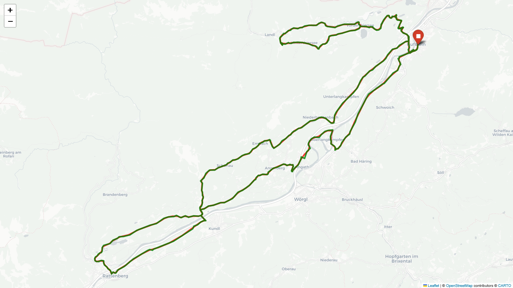
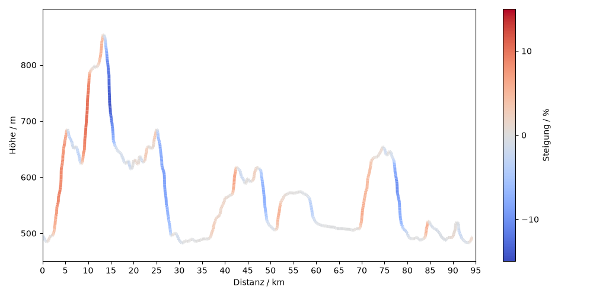

### 2. Fahrdaten und Systemparameter
Die zeitlichen Verläufe der berechneten System- und Fahrgrößen werden anschaulich über die gesamte Dauer der Fahrt dargestellt:
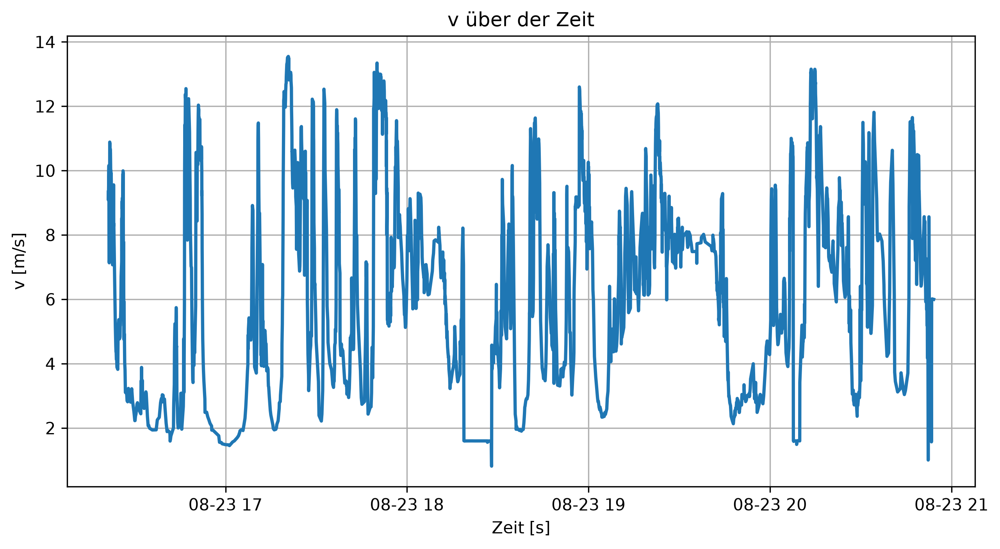
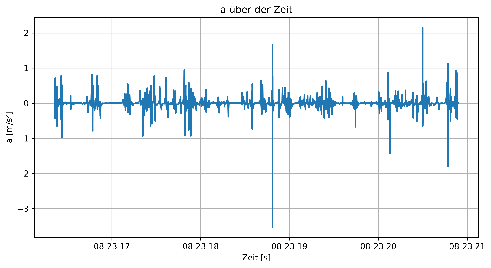
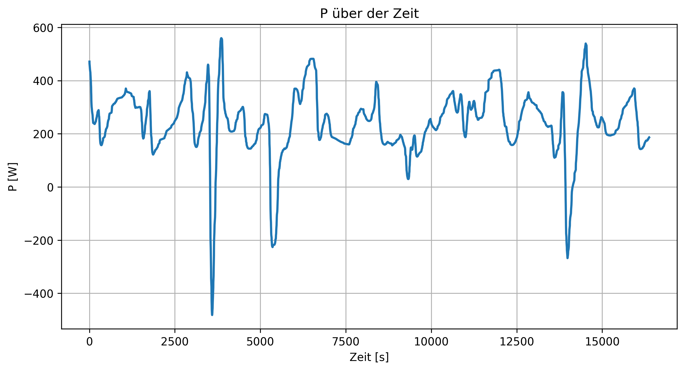
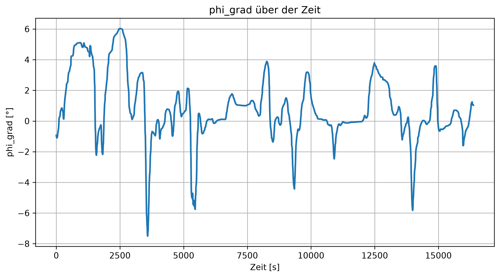
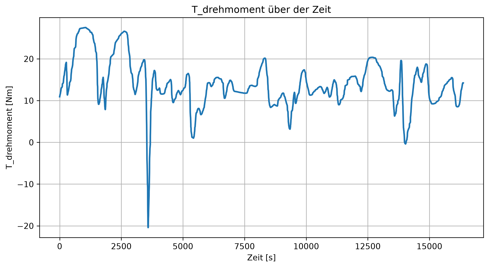
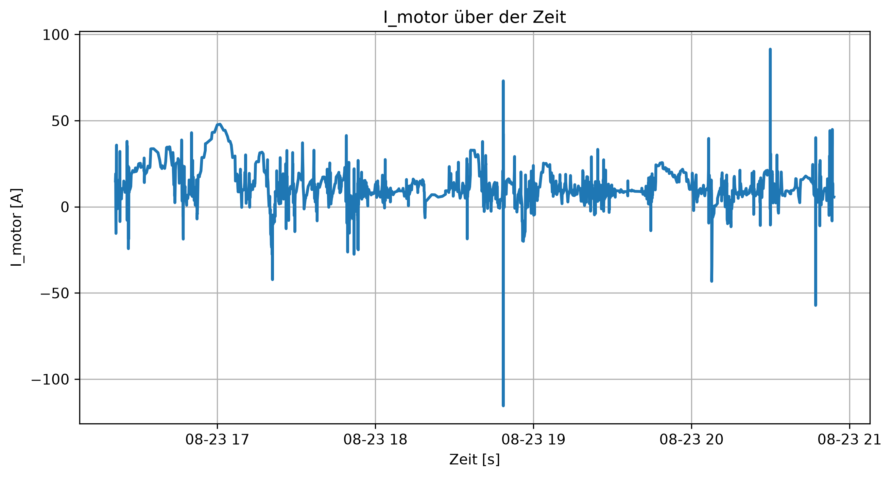
### 3. Entwicklung des Ladezustands über die Fahrt (LiFePO vs. NMC)
Entladeverhalten der beiden simulierten Akkutypen über den Verlauf der Fahrt, welches für beide Akkutypen identisch ist:

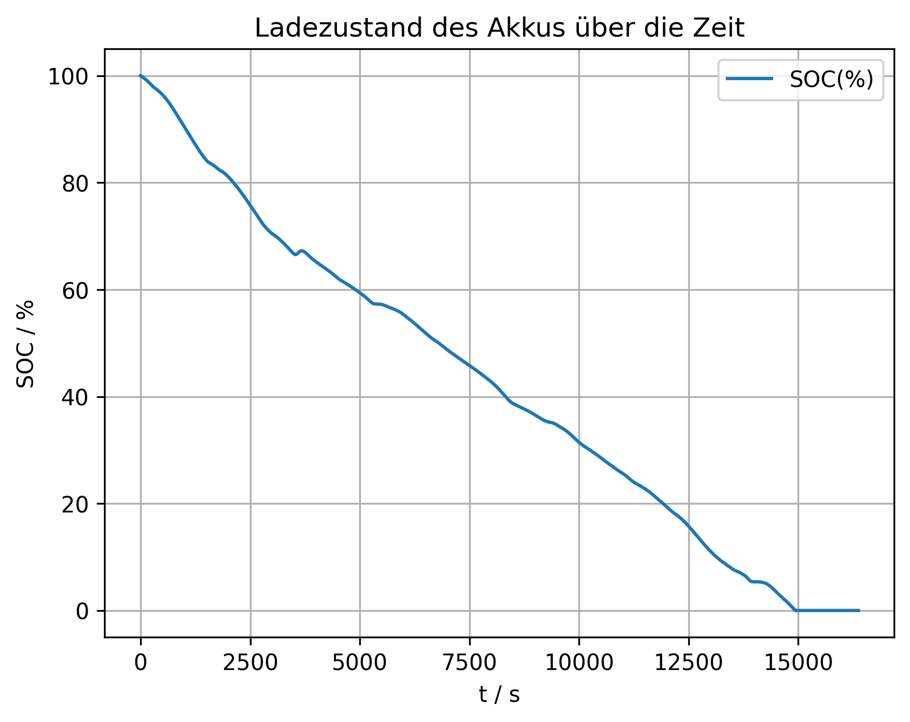

## UML-Diagramm
In der nachfolgenden Abbildung ist das UML-Diagramm zu sehen.

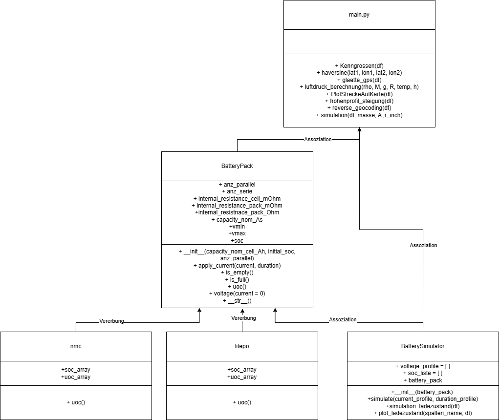
## Aktivitätsdiagramm
In der nachfolgenden Abbildung ist das Aktivitätsdiagramm zu sehen.

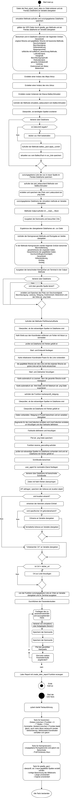


